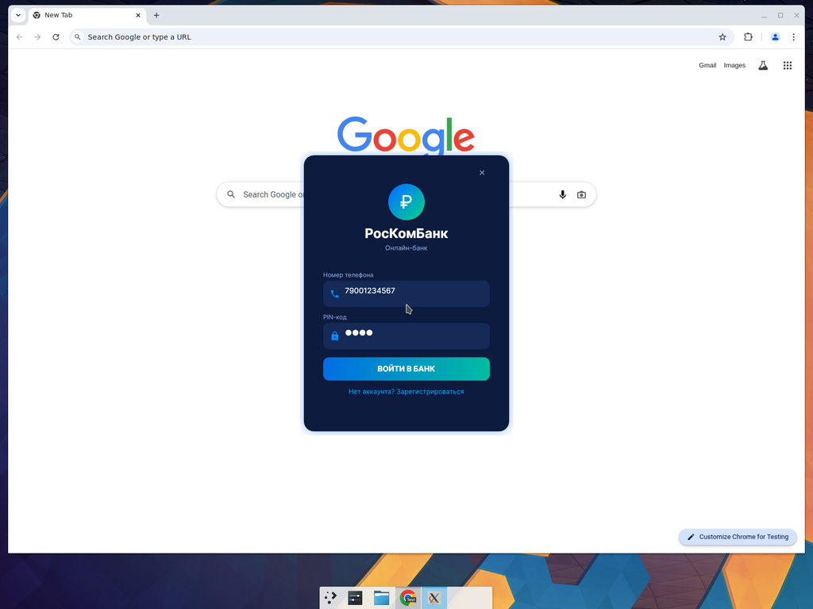
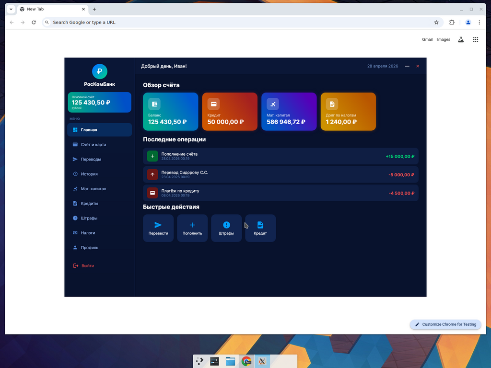
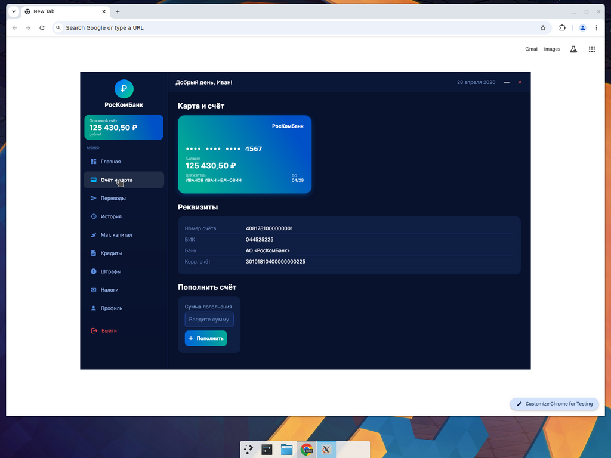
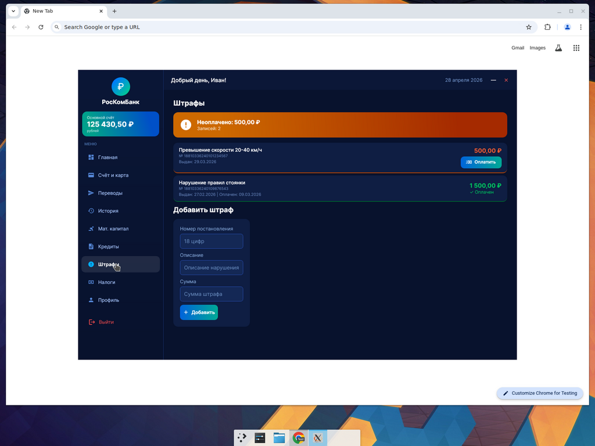

# РосКомБанк

Кросс-платформенный десктоп-клиент демо-онлайн-банка.

Изначально программа была написана как WPF-приложение под Windows. Этот репозиторий — порт на **Avalonia UI 11**, чтобы её можно было запускать нативно под Linux (Arch + GNOME, Wayland/X11), macOS и Windows.

## Стек

- **.NET 8** (`Microsoft.NETCore.App` ≥ 8.0)
- **Avalonia 11.2** (`Avalonia`, `Avalonia.Desktop`, `Avalonia.Themes.Fluent`, `Avalonia.Fonts.Inter`)
- **Material.Icons.Avalonia 2.1** — замена `MaterialDesignThemes.Wpf`
- **EF Core 8** + **SQLite** (база `roskombank.db` создаётся рядом с бинарём при первом запуске)

## Скриншоты

Окно входа · Главная · Карта · Штрафы:






## Запуск на Arch Linux + GNOME

GNOME подходит и в X11-, и в Wayland-сессии — Avalonia 11 умеет в обе. Эмодзи-иконки в дашборде требуют шрифта с эмодзи (Noto Color Emoji).

### 1. Установить зависимости

```sh
sudo pacman -S --needed dotnet-sdk dotnet-runtime aspnet-runtime sqlite \
                        noto-fonts noto-fonts-emoji ttf-dejavu fontconfig
```

`dotnet-sdk` нужен только для сборки. Если ты планируешь запускать готовый self-contained бинарь — достаточно `sqlite` и шрифтов (см. ниже про publish).

Проверь версию SDK (нужна ≥ 8.0):

```sh
dotnet --info
```

### 2. Склонировать и собрать

```sh
git clone https://github.com/<твой-юзер>/RosKomBank.git
cd RosKomBank/src/RosKomBank
dotnet restore
dotnet build -c Release
```

### 3. Запустить из исходников

```sh
dotnet run -c Release
```

Тестовый аккаунт (создаётся автоматически при первом запуске):

| Поле     | Значение      |
|----------|---------------|
| Телефон  | `79001234567` |
| PIN      | `1234`        |

### 4. (Опционально) собрать self-contained бинарь

Чтобы получить один исполняемый файл, который можно копировать на любую Arch-машину без установленного .NET:

```sh
dotnet publish -c Release -r linux-x64 --self-contained true \
               -p:PublishSingleFile=true -p:IncludeNativeLibrariesForSelfExtract=true
./bin/Release/net8.0/linux-x64/publish/RosKomBank
```

### 5. Запуск под Wayland / X11

Avalonia сама определяет сессию. Если хочешь принудительно X11 в Wayland-сессии GNOME:

```sh
AVALONIA_X11_USE_EGL=1 dotnet run -c Release
```

Если что-то странно рендерится (например, чёрные углы вместо скруглений) — попробуй отключить аппаратное ускорение:

```sh
AVALONIA_USE_GPU=0 dotnet run -c Release
```

### 6. База данных

`roskombank.db` (SQLite) создаётся в текущей рабочей директории при первом запуске. Удалить — пересоздастся с дефолтным пользователем и парой тестовых транзакций/штрафов.

```sh
rm roskombank.db
```

## Что портировано

- ✓ Окно входа (`LoginWindow`)
- ✓ Окно регистрации (`RegisterWindow`)
- ✓ Главное окно (`MainBankWindow`) со всеми 9 разделами:
  - Главная (Dashboard)
  - Счёт и карта
  - Переводы
  - История
  - Мат. капитал
  - Кредиты (с калькулятором аннуитета)
  - Штрафы
  - Налоги
  - Профиль (включая смену PIN)

## Чем отличается от WPF-оригинала

| WPF                                                   | Avalonia-аналог                                                |
|-------------------------------------------------------|----------------------------------------------------------------|
| `System.Windows.*`                                    | `Avalonia.*`                                                   |
| `MaterialDesignThemes.Wpf.PackIcon` / `PackIconKind`  | `Material.Icons.Avalonia.MaterialIcon` / `MaterialIconKind`    |
| `PasswordBox` (свойство `Password`)                   | `TextBox { PasswordChar = '●' }` (свойство `Text`)             |
| `WindowStyle.None` + `AllowsTransparency`             | `SystemDecorations.None` + `TransparencyLevelHint`             |
| `DragMove()`                                          | `BeginMoveDrag(PointerPressedEventArgs)`                       |
| `MouseLeftButtonDown` / `MouseEnter` / `MouseLeave`   | `PointerPressed` / `PointerEntered` / `PointerExited`          |
| `Visibility.Collapsed/Visible`                        | `IsVisible = false/true`                                       |
| `DropShadowEffect`                                    | `Border.BoxShadow` (нативное в Avalonia 11)                    |
| `Application.Current.Shutdown()`                      | `IClassicDesktopStyleApplicationLifetime.Shutdown()`           |
| `LinearGradientBrush(c1, c2, angleDeg)`               | `UiHelpers.Gradient(c1, c2, angleDeg)` (см. `Helpers.cs`)      |
| `ControlTemplate` + `FrameworkElementFactory` для скругления кнопок | `Button.CornerRadius` (нативное)                  |
| `MessageBox.Show`                                     | `UiHelpers.ShowInfo` (своё мини-модальное окно)                |
| `System.Windows.Threading.DispatcherTimer`            | `Avalonia.Threading.DispatcherTimer`                           |

База данных и бизнес-логика (`User`, `Transaction`, `Fine`, `BankContext`) перенесены без изменений — EF Core кросс-платформенный.

## Структура

```
src/RosKomBank/
├─ Program.cs            # entry point + AppBuilder
├─ App.axaml             # Application + темы (Fluent + MaterialIconStyles)
├─ App.axaml.cs          # OnFrameworkInitializationCompleted: seed БД, открыть LoginWindow
├─ Models.cs             # User / Transaction / Fine / BankContext
├─ Helpers.cs            # UiHelpers: Gradient, Rgb/Argb, Icon, ShowInfo, Shutdown
├─ LoginWindow.cs
├─ RegisterWindow.cs
└─ MainBankWindow.cs     # все 9 разделов
```
